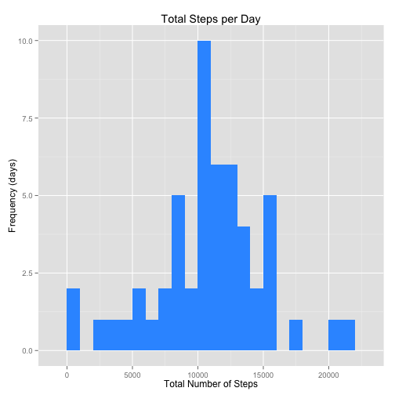
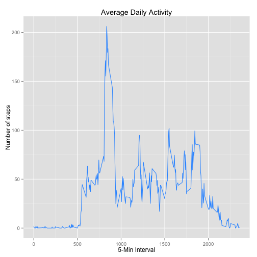
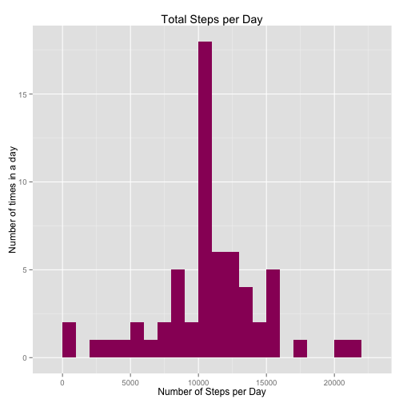
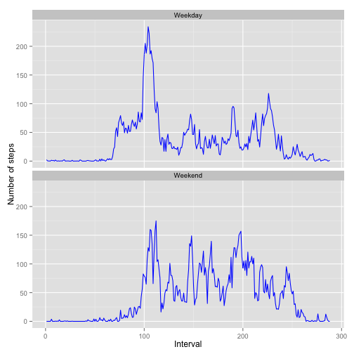

## Title: "Coursera Reproducible Research - Peer Assessment 1"

# author: "DAM"
# date: "June 14, 2015"
# output: html_document


# Introduction

It is now possible to collect a large amount of data about personal movement using activity monitoring devices such as a Fitbit, Nike Fuelband, or Jawbone Up. These type of devices are part of the “quantified self” movement – a group of enthusiasts who take measurements about themselves regularly to improve their health, to find patterns in their behavior, or because they are tech geeks. But these data remain under-utilized both because the raw data are hard to obtain and there is a lack of statistical methods and software for processing and interpreting the data.

This assignment makes use of data from a personal activity monitoring device. This device collects data at 5 minute intervals through out the day. The data consists of two months of data from an anonymous individual collected during the months of October and November, 2012 and include the number of steps taken in 5 minute intervals each day.

# Data

The data for this assignment can be downloaded from the course web site:

Dataset: Activity monitoring data [52K]

The variables included in this dataset are:

steps: Number of steps taking in a 5-minute interval (missing values are coded as NA)

date: The date on which the measurement was taken in YYYY-MM-DD format

interval: Identifier for the 5-minute interval in which measurement was taken

The dataset is stored in a comma-separated-value (CSV) file and there are a total of 17,568 observations in this dataset.

# 1.0. Setting the environment


```r
options(warn=-1)
library(knitr)
opts_chunk$set(echo = TRUE, results = 'hold')
library(data.table)
library(ggplot2)
options(warn=0)
setwd("~/Documents/COURSERAReproducible/RepData_PeerAssessment1")
```

# 2.0. Loading data from a CSV file.


```r
activity <- read.csv('activity.csv', header = TRUE, sep = ",",
                  colClasses=c("numeric", "character", "numeric"))
```

# 3.0. Process/transform the data (if necessary) into a format suitable for your analysis

Convert date field format and interval to factor


```r
activity$date <- as.Date(activity$date, format = "%Y-%m-%d")
activity$interval <- as.factor(activity$interval)
```

# 4.0. Calculate mean total number of steps taken per day


```r
steps_per_day <- aggregate(steps ~ date, activity, sum)
colnames(steps_per_day) <- c("date","steps")
head(steps_per_day)
```

```
##         date steps
## 1 2012-10-02   126
## 2 2012-10-03 11352
## 3 2012-10-04 12116
## 4 2012-10-05 13294
## 5 2012-10-06 15420
## 6 2012-10-07 11015
```

# 5.0 Make a histogram of the total number of steps taken each day

For this part of the assignment, you can ignore the missing values in the dataset. 


```r
ggplot(steps_per_day, aes(x = steps)) + 
       geom_histogram(fill = "#3399FF", binwidth=1000) + 
        labs(title="Total Steps per Day", 
             x = "Total Number of Steps", y = "Frequency (days)") + theme_gray() 
```

 

# 5.1.0 Calculate and report the mean total number of steps taken per day.

Mean total number of steps taken per day = 10766.19


```r
steps_mean   <- mean(steps_per_day$steps, na.rm=TRUE)
steps_mean
```

```
## [1] 10766.19
```

# 5.1.1. Calculate and report median total number of steps taken per day.

Median total number of steps taken per day = 10765


```r
steps_median <- median(steps_per_day$steps, na.rm=TRUE)
steps_median
```

```
## [1] 10765
```

# 6.0 Calculate the average daily activity pattern.


```r
steps_per_interval <- aggregate(activity$steps,by = list(interval = activity$interval),FUN=mean,
na.rm=TRUE)

steps_per_interval$interval <- 
        as.integer(levels(steps_per_interval$interval)[steps_per_interval$interval])
colnames(steps_per_interval) <- c("interval", "steps")
```

# 6.1. Make a time series plot (i.e. type = "l") of the 5-minute interval (x-axis) and the average number of steps taken, averaged across all days (y-axis).


```r
ggplot(steps_per_interval, aes(x=interval, y=steps)) +   
        geom_line(color="#3399FF") +  
        labs(title="Average Daily Activity", x="5-Min Interval", y="Number of steps") +  
        theme_gray()
```

 

# 6.2. Calculate the 5-minute interval, on average across all the days in the dataset, that contains the maximum number of steps.


```r
time_series <- tapply(activity$steps, activity$interval, mean, na.rm = TRUE)

max_interval <- which.max(time_series)
```

- Interval of maximum number of steps and Maximum number of steps
- Interval of maximum number of steps = 835
- Max number of steps = 206.1698


```r
names(max_interval)
time_series["835"]
```

```
## [1] "835"
##      835 
## 206.1698
```


# 7.0 Imputing missing values.

Number of missing values = 2304


```r
activity_NA <- sum(is.na(activity))
activity_NA
```

```
## [1] 2304
```

# 7.1 Devise a strategy for filling in all of the missing values in the dataset. 

The strategy does not need to be sophisticated.For example, you could use the mean/median for that day, or the mean for that 5-minute interval, etc.


```r
StepsAverage <- aggregate(steps ~ interval, data = activity, FUN = mean)
NAfiller <- numeric()
for (i in 1:nrow(activity)) {
    obs <- activity[i, ]
    if (is.na(obs$steps)) {
        steps <- subset(StepsAverage, interval == obs$interval)$steps
    } else {
        steps <- obs$steps
    }
    NAfiller <- c(NAfiller, steps)
}
```

# 7.2 Create a new dataset that is equal to the original dataset but with the missing data filled in.


```r
activityNew <- activity
activityNew$steps <- NAfiller
```

# 7.3 Make a histogram of the total number of steps taken each day.


```r
StepsTotal <- aggregate(steps ~ date, data = activityNew, sum, na.rm = TRUE)

ggplot(StepsTotal, aes(x = steps)) + 
       geom_histogram(fill = "#990066", binwidth = 1000) + 
        labs(title="Total Steps per Day", 
             x = "Number of Steps per Day", y = "Number of times in a day") + theme_gray() 
```

 

# 7.4 Report the mean and median total number of steps taken per day.

- Total steps mean = 10766.19
- Total steps median = 10766.19


```r
mean(StepsTotal$steps)
median(StepsTotal$steps)
```

```
## [1] 10766.19
## [1] 10766.19
```


# 7.5 Do these values differ from estimates from the first part of the assignment?

What is the impact of imputing missing data on the estimates of the total daily
number of steps?

Answer: After replacing the NAs by the mean the original values of mean and median didn't change significantly.

# 8.0 Are there differences in activity patterns between weekdays and weekends?

For this part the weekdays() function may be of some help here. Use the dataset with the filled in missing values for this part.
Create a new factor variable in the dataset with two levels -- "weekday" and "weekend" indicating whether a given date is a weekday or weekend day.


```r
day <- weekdays(activity$date)

dayType <- vector()
for (i in 1:nrow(activity)) {
    if (day[i] == "Saturday") {
        dayType[i] <- "Weekend"
    } else if (day[i] == "Sunday") {
        dayType[i] <- "Weekend"
    } else {
        dayType[i] <- "Weekday"
    }
}
activity$dayType <- dayType
activity$dayType <- factor(activity$dayType)

StepsByDay <- aggregate(steps ~ interval + dayType, data = activity, mean)
names(StepsByDay) <- c("interval", "dayType", "steps")
```

# 8.1 Make a panel plot containing a time series plot (i.e. type = "l") of the 5-minute interval (x-axis) and the average number of steps taken, averaged across all weekday days or weekend days (y-axis).

The plot should look something like the following, which was created using simulated data.
    

```r
ggplot(StepsByDay, aes(x=as.integer(interval), y=steps)) + 
        geom_line(color="#0033FF") + 
        facet_wrap(~ dayType, ncol=1) +
        labs(x="Interval", y="Number of steps") +
        theme_gray()
```

 
    
    
